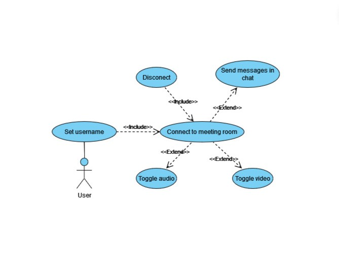

# Meeting room

## Use case diagram

## Technologies

-   python
-   django
-   websockets
-   WebRTC
-   javascript

## Short description how it works

-   we connect user to websocket
-   use websocket connection to exchange local description of RTC data channel
-   connect to existing clients using RTC peer to peer connection and translate video and audio
